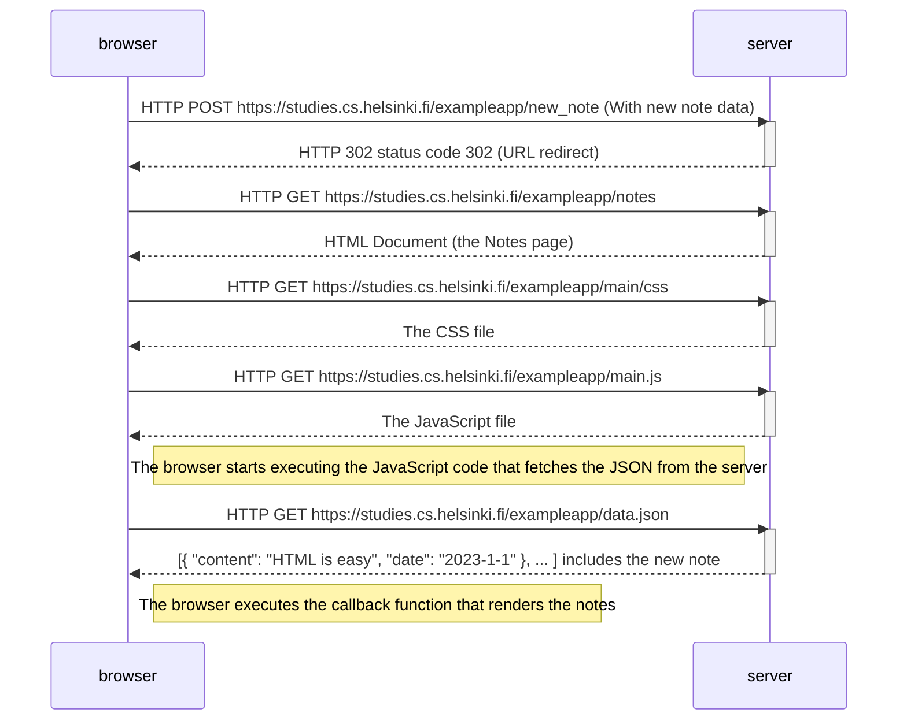

```mermaid
sequenceDiagram
    participant browser
    participant server

    browser->>server: HTTP POST https://studies.cs.helsinki.fi/exampleapp/new_note (With new note data)
    activate server
    server-->>browser: HTTP 302 status code 302 (URL redirect)
    deactivate server

    browser->>server: HTTP GET https://studies.cs.helsinki.fi/exampleapp/notes
    activate server
    server-->>browser: HTML Document (the Notes page)
    deactivate server

    browser->>server: HTTP GET https://studies.cs.helsinki.fi/exampleapp/main/css
    activate server
    server-->>browser: The CSS file
    deactivate server

    browser->>server: HTTP GET https://studies.cs.helsinki.fi/exampleapp/main.js
    activate server
    server-->>browser: The JavaScript file
    deactivate server

    Note right of browser: The browser starts executing the JavaScript code that fetches the JSON from the server

    browser->>server: HTTP GET https://studies.cs.helsinki.fi/exampleapp/data.json
    activate server
    server-->>browser: [{ "content": "HTML is easy", "date": "2023-1-1" }, ... ] includes the new note
    deactivate server

    Note right of browser: The browser executes the callback function that renders the notes
```