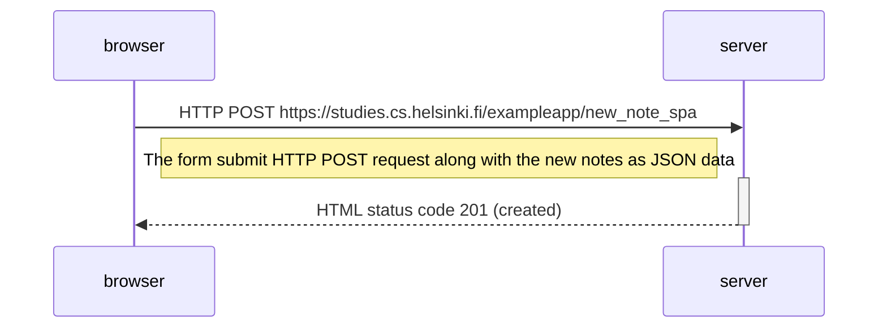

```mermaid
sequenceDiagram
    participant browser
    participant server

    browser->>server: HTTP POST https://studies.cs.helsinki.fi/exampleapp/new_note_spa
    Note left of server: The form submit HTTP POST request along with the new notes as JSON data
    activate server
    server-->>browser: HTML status code 201 (created)
    deactivate server
```